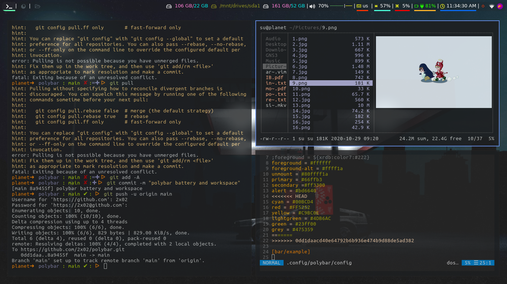
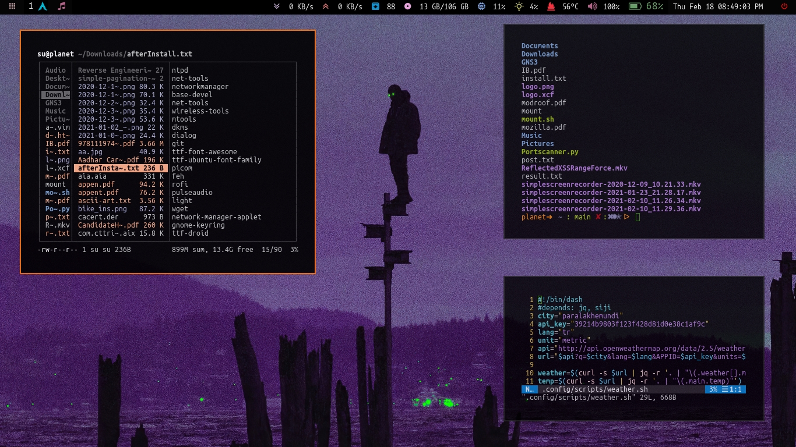

# polybar Dependency fonts

 ttf-font-awesome	-	pacman	

 siji		-	aur	

 unifont		-	aur	

# gpg Errors while installing unifont

echo "keyserver hkps://keyserver.ubuntu.com" >> $HOME/.gnupg/gpg.conf

# setup instruction

https://github.com/polybar/polybar/wiki

# Install My config

 bash -c "bash <(curl -sL https://raw.githubusercontent.com/2x02/polybar/main/install.sh)"

 Then execute bash ~/.config/polybar/launch.sh to launch Polybar.

# 1

  

# 2

  

